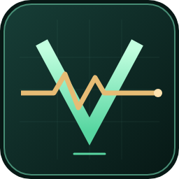

<p align="center"></p>

<h1 align="center">valheim-boosted</h1>
<p align="center"><strong>See what your connection is doing.</strong><br>0.1.0 · Pre-alpha · Valheim networking diagnostics</p>

An in-game diagnostics HUD and a live server dashboard, built to help explain lag with measurements. This pre-alpha collects data and enables fair replication scheduling by default for dedicated Steam servers. Opt-in experiments add per-peer send allowances, Steam maximum-rate tuning, ship captain ownership and negotiated lossless compression.

| Play with context | See the server |
| --- | --- |
| **F8 HUD** with a configurable corner | **Per-peer views** of latency, queues, and traffic |
| **Local timings** for frames and network updates | **Ownership counts** and bounded history charts |
| **Available transport metrics**, clearly labeled | **Freshness indicators** for missing or stale telemetry |
| **Experimental fair scheduling** | **Saved reports** and before/after comparisons |

## Install the mod

Import `valheim-boosted-0.1.0.zip` into a Valheim profile in r2modman or Thunderstore Mod Manager, with **BepInExPack Valheim** and **Jötunn** installed.

For a manual Linux installation, download **`valheim-boosted-0.1.0-plugins.zip`**, stop the server, and extract directly into its plugins directory:

```sh
unzip -o valheim-boosted-0.1.0-plugins.zip -d /path/to/BepInEx/plugins
```

For `valheim-server-docker`, use `/path/to/host/config/bepinex/plugins` as the destination, where that host config directory is mounted at `/config`. Both packages require BepInEx and Jötunn.

Enter a world and press **F8**. The HUD starts at the top right; configure it in `BepInEx/config/valheim.boosted.cfg`. Install on the server for server metrics and on participating clients for their FPS, frame timings, CPU and connection measurements. Client sharing defaults to enabled with a compatible server; unmodded clients can still join. **F9** marks a lag incident.

[Installation & configuration](docs/MOD-INSTALL.md) · [Changelog](CHANGELOG.md) · [Metric definitions](docs/OBSERVABILITY.md) · [Compatibility & switches](docs/COMPATIBILITY.md)

## Experimental fair scheduler

Stage 2 is enabled by default for dedicated Steam servers. New configs generate these settings in `valheim.boosted.cfg`. Existing configs retain their saved values; edit and restart to change them:

```ini
[Scheduling]
Enabled = true
MaxCallsPerFrame = 4
TimeBudgetMs = 2
MaxDebtPerPeer = 2
```

Set `Enabled = false` and restart to use vanilla scheduling or collect a baseline. The scheduler targets fair 20 Hz send opportunities with bounded catch-up work. Stage 2 alone preserves vanilla packet formats and queue limits. The dashboard shows service age, scheduler work, process CPU/RSS, heartbeat age, queue growth, frame tails and save timings. [Behavior, fallback & testing →](docs/SCHEDULING.md)

## Experimental stages 3–5

| Stage | Behavior | Enable in `valheim.boosted.cfg` |
| --- | --- | --- |
| **3 · Send windows** | Adapt per-peer ZDO allowances to RTT and unsent queue pressure | `[SendWindows] Enabled = true` |
| **3 · Steam rate** | Raise connection maximums with readback and restoration | `[SteamRate] Enabled = true` |
| **4 · Captain ownership** | Assign eligible vanilla ships to their granted, attached captain | `[CaptainOwnership] Enabled = true` |
| **5 · Compression** | Negotiate lossless ZDO compression with compatible peers | `[Compression] Enabled = true` on both endpoints |

**These new switches default to false and require a restart.** Stages 3–4 run on dedicated Steam servers; unmodded clients remain supported. The dashboard shows actual activation, per-peer settings, compression savings/cost and ship transfers, with report comparisons and seven-day history. General NPC ownership rebalancing remains future work; live multiplayer validation is pending. [Defaults, bounds and fallback behavior →](docs/SERVER-IMPROVEMENTS.md)

## Start the metrics server

Dedicated servers now use [empty-server idle mode](docs/IDLE-SERVER.md): after 60 seconds without peers or a save, the main-loop cap drops to 10 FPS and telemetry runs every five seconds. A joining peer restores normal cadence. Configure or disable it under `[IdleServer]`; physics timing is unchanged and live CPU savings still need measurement.

The **Svelte + TypeScript + LayerChart** dashboard runs separately from Valheim, served by **Bun 1.4.0** on port **8080**. It reads the mod's JSON export; no connection to the game port is needed.

### Run with Bun

From the repository root:

```sh
bun install --frozen-lockfile
bun run build
HOST=127.0.0.1 PORT=8080 \
  TELEMETRY_PATH="$PWD/.local/profile/BepInEx/valheim-boosted-telemetry/snapshot.json" \
  HISTORY_SAMPLES=300 STALE_AFTER_MS=5000 \
  bun start
```

This example reads the development profile. Set the mod's `[Telemetry] ExportPath` to the same absolute development-profile path first; its default is `/config/valheim-boosted/telemetry/snapshot.json`. For another server, set `TELEMETRY_PATH` to its snapshot path **as seen by the Bun process**. The page shows **Waiting** until the mod exports a snapshot.

### Run with Docker

For a Valheim container with `/srv/valheim/config:/config` mounted, new configs use these defaults. Existing configs retain their saved values: update `/config/bepinex/valheim.boosted.cfg` to match, then restart Valheim:

```ini
[Telemetry]
Enabled = true
ExportOnServer = true
ExportPath = /config/valheim-boosted/telemetry/snapshot.json
```

Share that export directory with the metrics container:

| Location | Path |
| --- | --- |
| Valheim container writes | `/config/valheim-boosted/telemetry/snapshot.json` |
| Docker host stores | `/srv/valheim/config/valheim-boosted/telemetry/snapshot.json` |
| Metrics container reads | `/telemetry/snapshot.json` |

Create the host directory first, with permissions that let Valheim write and the metrics image's `bun` user read it. Adjust the host path to match your existing Valheim volume. From the repository root:

```sh
docker build -f docker/metrics.Dockerfile -t valheim-boosted-metrics:local .
docker run -d --name valheim-boosted-metrics --restart unless-stopped \
  -p 127.0.0.1:8080:8080 \
  -e HOST=0.0.0.0 -e PORT=8080 \
  -e TELEMETRY_PATH=/telemetry/snapshot.json \
  -e HISTORY_SAMPLES=300 -e STALE_AFTER_MS=5000 \
  -e REPORTS_DIRECTORY=/reports \
  -e HISTORY_RETENTION_DAYS=7 \
  --mount type=bind,source=/srv/valheim/config/valheim-boosted/telemetry,target=/telemetry,readonly \
  --mount type=volume,source=valheim-boosted-reports,target=/reports \
  valheim-boosted-metrics:local
```

Mount the **whole directory** read-only: the mod replaces `snapshot.json` atomically, so mounting only the file can leave the reader seeing an old snapshot. `HOST=0.0.0.0` lets Docker reach Bun inside the container; the port mapping exposes it only on the host's loopback interface.

The writable `valheim-boosted-reports` volume preserves saved reports when the metrics container is replaced. The Compose example also includes a reports volume. If using a host bind mount for `/reports`, make it writable by the image's `bun` user.

Or use the included Compose file:

```sh
TELEMETRY_DIRECTORY=/srv/valheim/config/valheim-boosted/telemetry \
  docker compose -f docker/compose.metrics.yml up -d --build
```

`TELEMETRY_DIRECTORY` selects the **host mount source** for Compose; `TELEMETRY_PATH` selects the **snapshot file inside the metrics process**.

### Environment variables

| Variable | Default | Purpose |
| --- | --- | --- |
| `HOST` | `127.0.0.1`; `0.0.0.0` in Docker | HTTP bind address |
| `PORT` | `8080` | HTTP port; match Docker's container-port mapping if changed |
| `TELEMETRY_PATH` | Development-profile path above; `/telemetry/snapshot.json` in Docker | JSON snapshot to read |
| `HISTORY_SAMPLES` | `300` | Keep 1–3600 snapshots in memory; resets on restart or world/process change |
| `REPORTS_DIRECTORY` | `.local/reports`; `/reports` in Docker | Persistent JSON reports; use a writable volume in Docker |
| `HISTORY_RETENTION_DAYS` | `7` | Retain detailed timeline samples for 1–365 days; expired samples are removed automatically |
| `HISTORY_DATABASE_PATH` | `history.sqlite` inside `REPORTS_DIRECTORY` | SQLite database; keep its parent directory writable and persistent |
| `STALE_AFTER_MS` | `5000` | Minimum stale threshold, 1000–300000 ms; extended to three sample intervals |

Open [localhost:8080](http://127.0.0.1:8080) on the host. For an SSH host, forward port 8080 in VS Code's **Ports** panel. The service has no built-in authentication; use an access-controlled reverse proxy if exposing it beyond localhost.

[API details & deployment notes →](dashboard/README.md)

### Compare a networking change

1. On the overview, **Reset stats** after warm-up, run a repeatable scenario, name the recording and **Save report**.
2. Apply your change, restart Valheim if required, reset stats and repeat with the same world, player count, activity and duration.
3. Open **Compare reports** to choose a baseline and candidate, review measurement coverage and settings, and download either report as JSON.

Reset affects the dashboard's unsaved aggregates and live charts for all viewers; it does not reset Valheim's counters or delete saved reports. Recording pauses when the game session or exported settings change. Unsaved recordings are lost when the metrics service restarts. [Report definitions and limitations →](docs/REPORTS.md)

### Correlate player and server lag

Open **History** to align server frame times, client-reported frame times, and server/client connection measurements. Choose a time range and players, then click a chart or a player's lag marker to inspect the same time across all tracks. Gaps, delayed delivery and clock uncertainty remain visible. Detailed history defaults to **seven days**, survives metrics-container restarts, and is independent of **Reset stats**. Saved reports also preserve a bounded timeline after live history expires.

Returning Steam players are **combined across logins by default**, with separate session records and weighted totals that exclude offline gaps. Turn off **Combine returning players across sessions** to inspect individual logins. Preserve the server config's generated `ClientTelemetry.IdentityKey` across restarts; it creates server-scoped player IDs without exporting Steam IDs. Character names never determine identity, and older history without identity stays separate.

Client/server configuration (restart after changing):

```ini
[ClientTelemetry]
ShareWithServer = true
ReceiveFromClients = true
IncludePlayerNames = true
MarkLagKey = F9
```

`ShareWithServer` controls the local client's reporting; `ReceiveFromClients` and `IncludePlayerNames` apply on the server. Names are server-known character names, not Steam IDs. Set `IncludePlayerNames = false` for opaque player labels (session labels when identity is unavailable). Local `ExportOnClient` JSON export is independent and can stay disabled. [Protocol, history model and performance limits →](docs/HISTORY.md)

## Develop

```sh
python3 scripts/dev.py build
python3 scripts/dev.py deploy
```

The mod requires local Valheim references and BepInEx/Jötunn libraries; follow the [Linux + VS Code setup](docs/DEVELOPMENT.md). For UI development, run `bun run dev` and `bun run dev:ui` in separate terminals.

`mod/` holds the C# plugin, `dashboard/` the UI and Bun server, and `thunderstore/` the package metadata and artwork. GitHub workflows build the mod ZIP and a separate metrics image. [Build & release guide →](docs/CI.md)

To release, write your notes in GitHub's **Draft a new release** editor, choose the pre-release checkbox if needed, and save the draft. Use a plain numeric tag such as `0.1.0`, without a `v` prefix. Run **Prepare GitHub release** with its tag to attach both installation ZIPs and checksums, then publish from the editor. [Release steps →](docs/CI.md#create-a-github-release-or-pre-release)

**Pre-alpha status:** in-game validation and Docker execution remain pending. The Thunderstore package identifier is `valheim_boosted`; the project and mod name remain **valheim-boosted**.
